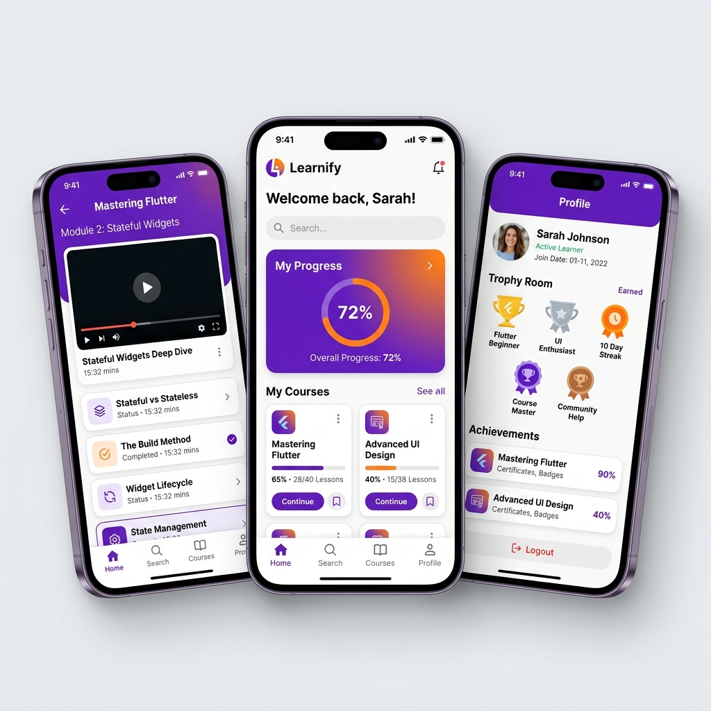

# 🚀 Learnify: Elevate Your Learning Journey



**Learnify** is a premium, feature-rich Flutter application designed to provide a seamless and gamified learning experience. From interactive video lessons to real-time progress tracking and achievement rewards, Learnify makes mastering new skills engaging and intuitive.

---

## ✨ Key Features

| | | |
| :--- | :--- | :--- |
| 📺 **Seamless Video Integration** | 📊 **Dynamic Progress Tracking** | 🏆 **Gamified Achievements** |
| Learn through high-quality YouTube lessons integrated directly into the app. | Real-time visualization of your learning journey with interactive stats. | Earn points, unlock trophies, and receive certificates upon completion. |
| 🔒 **Cloud Sync & Security** | 🌓 **Adaptive UI** | 📱 **Premium Experience** |
| Cross-device progress syncing powered by Firebase and Cloud Firestore. | Beautifully crafted Light and Dark modes that adapt to your style. | Glassmorphism-inspired design with smooth, high-end animations. |

---

## 🛠️ Tech Stack


---

## 🚀 Getting Started

### Prerequisites
- Flutter SDK (v3.11.4+)
- Firebase Account
- Android Studio / VS Code

### Installation

1. **Clone the repository**
   ```bash
   git clone https://github.com/yourusername/learnify_app.git
   ```

2. **Install dependencies**
   ```bash
   flutter pub get
   ```

3. **Configure Firebase**
   - Add your `google-services.json` (Android) and `GoogleService-Info.plist` (iOS).
   - Ensure `firebase_options.dart` is correctly generated.

4. **Run the app**
   ```bash
   flutter run
   ```

---

## 📂 Project Structure

```text
lib/
├── data/       # Course content & static data
├── models/     # Data models (Course, User, Progress)
├── screens/    # App screens (Home, Lessons, Quiz, Trophy Room)
├── services/   # Business logic (Auth, Firestore, Progress)
├── theme/      # Custom design system & theme data
└── widgets/    # Reusable UI components
```

---
Any course, lecture, or quiz you create in the React Web Admin Dashboard at http://localhost:5173/ is synced in real-time to Firebase Firestore.
To see the updated course counts on your Flutter console screen (http://localhost:56583/), simply click the Refresh Icon in the top-right corner of the Flutter app.

## 📄 License

This project is licensed under the MIT License - see the [LICENSE](LICENSE) file for details.

---

<p align="center">Made with ❤️ by Rejuyan</p>

